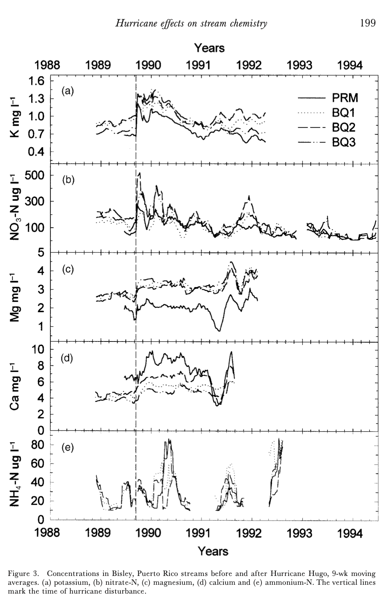

## EDS214 Data Exploration and Reproducibility

### **1) Purpose**

This project is intended to serve as practice for reproducing analysis and figures produced by scientific research that is published to GitHub. The data and analysis in this repository is an attempt at reproducing Schaefer et. al's research about nutrient levels in lakes and streams after hurricane Hugo in Puerto Rico in 1989. More specifically, this repo is purposed to reproduce Fig. 2 of Schaefer et. al.'s paper, pictured below.

{width="300"}

### **2) Contents**

This repo contains scripts which house code that seeks to recreate the analysis performed to create the figure picture above. In addition to scripts, this repo contains all of the raw and cleaned data that was utilized in Schaefer et. al.'s research, and obtained from the Environmental Data Initiatives website at (<https://portal.edirepository.org/nis/mapbrowse?packageid=knb-lter-luq.20.4923064>).

### **3) Data Access**

Schaefer et. al's raw data is made publicly available by the Environmental Data Initiative organisation, and can be downloaded at the link provided in the contents section. A citation for the data source is also located below in the references for this repository.

### **4) Author**

Henry Oliver, the author of this repository is currently a student in the Masters of Environmental Data Science program at the University of California, Santa Barbara.

### **5) References**

Schaefer, D. A., McDowell, W. H., Scatena, F. N., & Asbury, C. E. (2000). *Effects of hurricane disturbance on stream water concentrations and fluxes in eight tropical forest watersheds of the Luquillo Experimental Forest, Puerto Rico*. **Journal of Tropical Ecology, 16**, 189–207. <https://doi.org/10.1017/S0266467400001358>

McDowell, W. and International Institute of Tropical Forestry(IITF), USDA Forest Service.. 2024. Chemistry of stream water from the Luquillo Mountains ver 4923064. Environmental Data Initiative. <https://doi.org/10.6073/pasta/f31349bebdc304f758718f4798d25458> (Accessed 2025-08-26).
