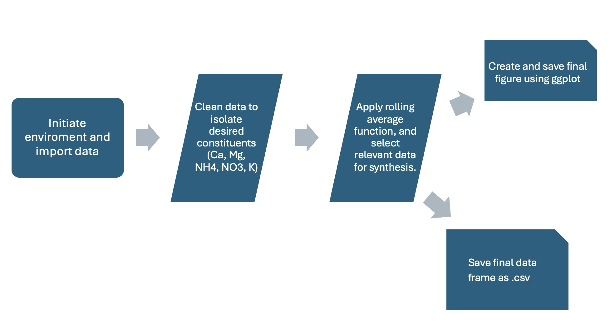

## EDS214 Data Exploration and Reproducibility

### **1) Purpose**

This project is intended to serve as practice for reproducing analysis and figures produced by scientific research that is published to GitHub. The data and analysis in this repository is an attempt at reproducing Schaefer et. al's research about nutrient levels in lakes and streams after hurricane Hugo in Puerto Rico in 1989. More specifically, this repo is purposed to reproduce Fig. 2 of Schaefer et. al.'s paper, pictured below.

{width="300"}

### **2) Contents**

This repo contains scripts which house code that seeks to recreate the analysis performed to create the figure picture above. In addition to scripts, this repo contains all of the raw and cleaned data that was utilized in Schaefer et. al.'s research, and obtained from the Environmental Data Initiatives website at (<https://portal.edirepository.org/nis/mapbrowse?packageid=knb-lter-luq.20.4923064>).

##### **data**

Contains the raw data from Schaeffer et. al. 2000 for ion (constituent) levels in four watersheds in Puerto Rico

##### **R**

Contains the script for defining the rolling average function that is used in analysis.

##### **1_environment_init**

Contains the script which installs all necessary packages for analysis.

##### **2_data_cleaning**

Contains the scripts that import the necessary data, and the script that cleans the data before analysis.

##### **3_analysis**

Contains the primary analysis of the cleaned data. The script in this folder applies the roll_mean function for each constituent value, and subsequently cleans/transforms the data into a final data frame called data_comb_avgs.

##### **4_processed_data**

Contains an export of the data frame used to plot Figure 3, saved as data_comb_avgs.csv

##### **5_plot**

Contains the script that produces Figure 3

##### **docs**

Contains the quarto document that can be rendered to view the steps taken and the files referenced to produce Figure 3

#### **figs**

### **3) Flowchart**

The flowchart below provides a visual for the workflow of this project

{width="500"}

### **4) How to Perform this analysis**

In order to perform this analysis, the user's computer must have the R software language installed and, optionally, the RStudio Integrated Development Language. The analysis can be performed with ease by rendering the Quarto document titled "paper.qmd" contained in the "docs" folder in the repository. A more detailed explanation of the analysis can be broken down into 5 steps, listed below:

#### **1 - Environment Initialization**

Once R is installed on your machine, the first step is to initialize the environment for this project by running "environment_init.R" contained in the "1_env_init" directory. This step installs the following packages and functions necessary to run the analysis:

-   (tidyverse) - tools for data manipulation, visualization, and analysis

-   (here) - simplifies file referencing

-   (janitor) - provides functions for data cleaning

-   (lubridate) - provides functions for parsing, extracting, and manipulating date-time data

#### **2 - Data Import**

The next step is to import the raw data, contained in the "data" directory. This is achieved by running the "data_import.R" script contained in the "2_data_cleaning" directory. This should populate the environment in R with 4 data frames titled "prm", "bq1", "bq2", and "bq3".

#### **3 - Data Cleaning**

This step modifies the raw data in preparation for analysis. This is achieved by running the "clean_data.R" script contained in the "2_data_cleaning" directory. This step binds the four data frames produced in Step 2 into a single data frame, and mutates the data to only include relevant dates and columns. This should populate your environment with a data frame called "data_combined".

#### **4 - Analysis**

The analysis of this project consists of applying a function to the combined data frame produced in Step 3 that produces a new data frame which contains the rolling 9-week average of concentrations of the constituents being researched. This is achieved by running the "analysis.R" script contained in the "3_analysis" directory. This analysis will also produce a data table that contains the final data frame that will be used to plot the final figure. This data frame will be saved as "comb_data_avgs.csv" in the "4_processed_data" directory.

#### **5 - Plot Generation**

One the analysis is complete, and the relevant data frame "comb_data_avgs" is loaded into the environment, you are ready to produce a plot of the data. The plot can be generated by running the "plot.R" script contained in the "5_plot" directory.

### **4) Data Access**

Schaefer et. al's raw data is made publicly available by the Environmental Data Initiative organisation, and can be downloaded here: <https://portal.edirepository.org/nis/mapbrowse?scope=knb-lter-luq&identifier=20&revision=4923064>.

### **5) Author**

Henry Oliver, the author of this repository, is currently a student in the Masters of Environmental Data Science program at the University of California, Santa Barbara.

### **6) References**

Schaefer, D. A., McDowell, W. H., Scatena, F. N., & Asbury, C. E. (2000). *Effects of hurricane disturbance on stream water concentrations and fluxes in eight tropical forest watersheds of the Luquillo Experimental Forest, Puerto Rico*. **Journal of Tropical Ecology, 16**, 189–207. <https://doi.org/10.1017/S0266467400001358>

McDowell, W. and International Institute of Tropical Forestry(IITF), USDA Forest Service.. 2024. Chemistry of stream water from the Luquillo Mountains ver 4923064. Environmental Data Initiative. <https://doi.org/10.6073/pasta/f31349bebdc304f758718f4798d25458> (Accessed 2025-08-26).
